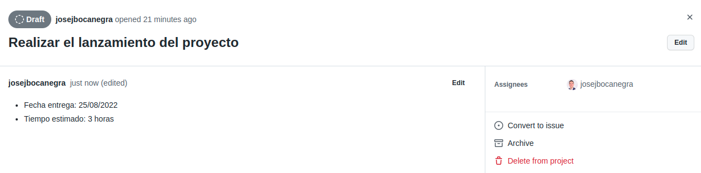

## Semana 3 - Hacer la planeación de la semana 3

### Objetivos

---

El objetivo de esta actividad es:

- Construir el plan de la semana para cumplir con los hitos establecidos y las acciones de mejora.

### Descrición actividad

---

####  Actividad individual

- Cada integrante crea en la columna "Todo" del Kanban de GitHub de su proyecto una tarea por cada actividad de la semana.
- Durante la semana, cada integrante, a medida que va iniciando o completando las tareas, actualiza el estado de la tarea en el Kanban de Github, moviéndola a la columna "In Progress" o "Done" según corresponda.

### Recursos

---

Formato definición de una tarea:

| Tarea: Detallar la HU << _aquí va el nombre de la historia_ >>             |
| -------------------------------------------------------------------------- |
| Fecha entrega: << _aquí va la fecha de entrega_ >>                         |
| Tiempo estimado: << _aquí va el tiempo que se estima tomará esta tarea_ >> |

Cuando edite la tarjeta, en la opción "Asignees" seleccione el integrante del equipo a quien se asignará la tarea.

Ejemplo:

|  |
| ----------------------------------------- |
| Fig. Ejemplo Kanban                       |

### Entregables

---

- Kanban del proyecto actualizado en Github.

### Criterios de evaluación

---

- Kanban con las tareas de la semana actualizado siguiendo el formato establecido.
